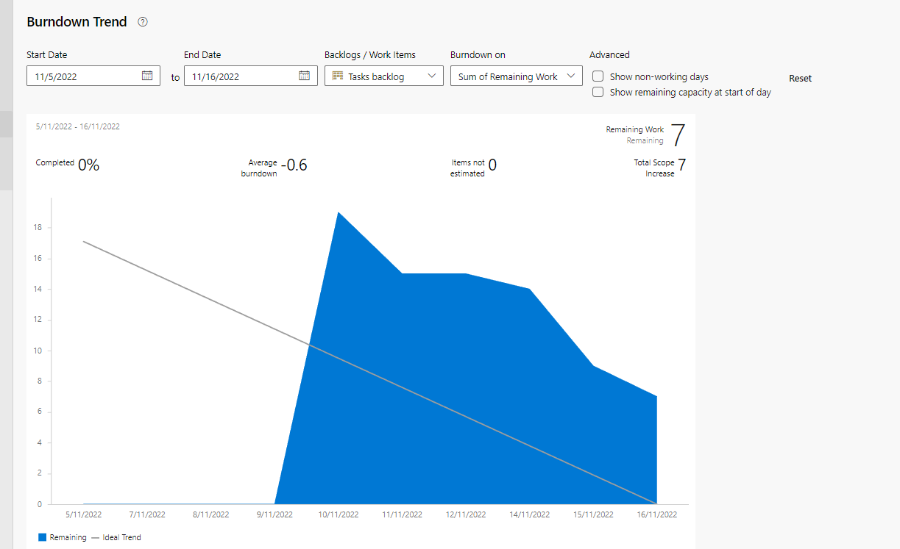
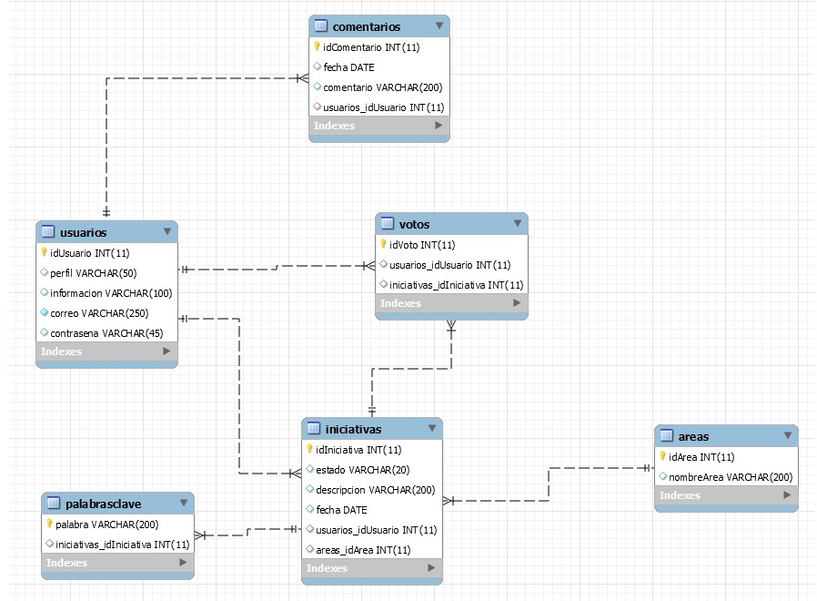

# ECIniciativas
## Escuela Colombiana de Ingeniería

### CVDS - 2022

#### Integrantes: Wilson Delgado, Juanita Oramas, Julia Mejia y Sebastian Rojas 

#### Contexto Del Proyecto 
La Plataforma banco de iniciativas de proyectos, es una herramienta donde la comunidad universitaria de la Escuela 
Colombiana de Ingeniería Julio Garavito pueden registrar sus iniciativas e ideas de proyectos para ser desarrollados o 
gestionados por la PMO de la Escuela.  

En la cual se pueden consultar otras iniciativas, las cuales están agrupadas por un area.

### Gestión del proyecto
Se realizaron 2 sprints. Se cuenta con el burndown chart de cada uno:

Sprint 1:

<imagen>
Burndown Trend

Sprint 2:

<imagen>

#### Definicion del diseño de la base de datos
Se define el modelo entidad relación:

Se procede a implementarlo en los servicios de Azure, usando una base de datos MySQL:

Servidor:

Pantalla de home:

#### Los items más importantes desarrollados durante el sprint fueron:

* Consultar iniciativas

* Consultar iniciativas por palabra clave

* Consultar iniciativas por usuario

* consultar iniciativas agrupadas

* modificar una iniciativa

* Reporte de las iniciativas por estado

### Análisis de código estático
Usando la herramienta de SonarQube se realizó un análisis de código estático sobre el proyecto y se encontró:

